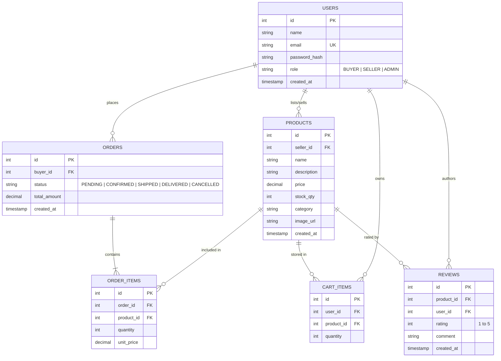
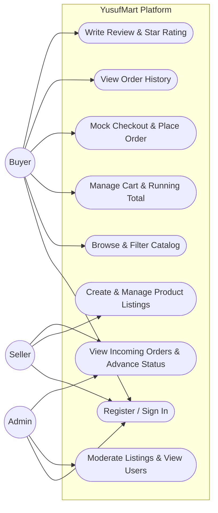
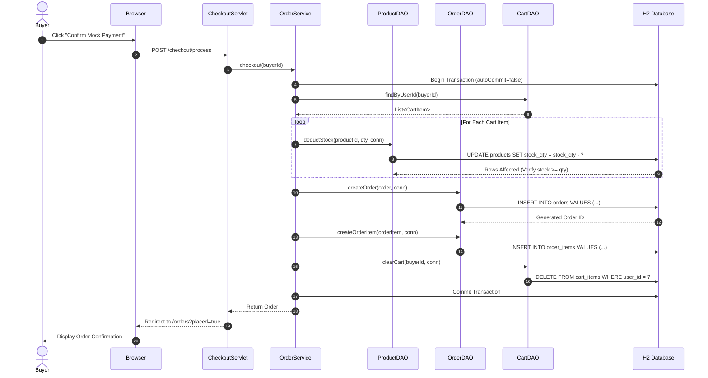

# YusufMart — Multi-Seller E-Commerce Marketplace Web Application

**Anna University R2025 Regulations — Semester 3 Project Specification**  
**Student Developer**: Mohamed Yusuf  
**Package Base**: `com.yusuf.yusufmart`  
**Milestone**: 2nd Review (Sep 21, 2026) — Full Build & Deployment Ready  

---

## 1. Project Overview & Problem Statement

**YusufMart** is an enterprise-grade multi-seller e-commerce web application built on standard Java Servlets and JDBC with Apache Tomcat. The platform addresses the requirement of a robust digital marketplace connecting independent sellers with buyers under administrative oversight:
- **Sellers** list products, manage inventory and pricing, and fulfill incoming orders.
- **Buyers** search, filter by category, manage shopping carts, and place orders via mock payment confirmation.
- **Administrators** moderate product listings, supervise users, and monitor transactions.

### Architectural Constraints Adhered To:
- **No real-time infrastructure**: Stateless HTTP request-response flow.
- **Mock payment integration**: Secure mock payment confirmation without third-party vendor dependencies.
- **Layered MVC over Servlets**: Clear separation of concerns across Controller, Service, and DAO layers.

---

## 2. Technology Stack Specification

| Component | Specification | Description |
|---|---|---|
| **JDK** | JDK 17 (LTS) | Java SE 17 enterprise runtime |
| **Servlet Container** | Apache Tomcat 9.0.x | `javax.servlet.*` Servlet 4.0 API |
| **Build Tool** | Apache Maven 3.9+ | Dependency management and build lifecycle |
| **Database** | H2 Database (v2.2) | Server & embedded modes, file-persisted |
| **Connection Pooling** | HikariCP 5.1.0 | High-performance JDBC connection pool |
| **Password Hashing** | jBCrypt 0.4 | Salted BCrypt password hashing |
| **View Layer** | JSP 2.3 + JSTL 1.2 | Server-side rendering with `<c:out>` XSS escaping |
| **Client Layer** | HTML5, CSS3, Vanilla JS | Responsive interface with `fetch()` API support |
| **JSON Serialization** | Google Gson 2.10.1 | DTO transformation and API envelopes |
| **Testing** | JUnit 5 + Mockito 5 | Unit & DAO testing against in-memory H2 |
| **Logging** | SLF4J 2.0 + Logback 1.5 | Structured logging with MDC Request IDs |
| **Continuous Integration** | GitHub Actions | Automated build & verification on every push |

---

## 3. Required System Diagrams

### D1: Entity-Relationship (ER) Diagram


---

### D2: Use Case Diagram


---

### D3: Sequence Diagram (Place-Order Transaction Flow)


---

## 4. Mandatory Feature Implementation Matrix (F1–F8)

| ID | Feature | Implementation Details | Status |
|---|---|---|---|
| **F1** | **User Registration & Login** | Two self-service roles (`BUYER`, `SELLER`). Admin seeded via `DataSourceListener`. Passwords salted and hashed with **jBCrypt**. Session fixation protected via `request.changeSessionId()` on login. | ✅ Complete |
| **F2** | **Seller Product CRUD** | Sellers create, edit, update stock/price, and delete listings. Authorization check ensures sellers can only edit their own listings. | ✅ Complete |
| **F3** | **Buyer Catalog & Search** | Keyword search across product name and description, category chip filters, price sorting, and live in-stock badges. | ✅ Complete |
| **F4** | **Shopping Cart** | Persistent cart (`cart_items`), quantity increase/decrease buttons, stock limit guardrails, and running total display. | ✅ Complete |
| **F5** | **Mock Checkout** | Shipping details collection, mock Card/UPI payment selection, and atomic transactional stock deduction with rollback safety. | ✅ Complete |
| **F6** | **Order History & Workflow** | **Buyer**: view historical orders and status. **Seller**: view incoming orders and update status (`PENDING` $\to$ `CONFIRMED` $\to$ `SHIPPED` $\to$ `DELIVERED`). | ✅ Complete |
| **F7** | **Admin Moderation** | Admin dashboard with live metric counters, user accounts oversight, all orders viewer, and instant listing moderation/removal. | ✅ Complete |
| **F8** | **Product Reviews & Ratings** | 1 to 5 star ratings and written feedback. Enforces business rule: reviews permitted **only** for buyers who purchased the product in a delivered order. | ✅ Complete |

---

## 5. Security & Engineering Checklist Compliance

- [x] **PreparedStatement Only**: Every single database query uses parameterized `PreparedStatement`. Zero string concatenation anywhere in the codebase.
- [x] **BCrypt Password Hashing**: Passwords stored as salted BCrypt hashes via `jBCrypt`. No plaintext or weak algorithms (MD5/SHA1).
- [x] **Session Fixation Prevention**: Session ID regenerated upon authentication via `request.changeSessionId()`. Explicit 30-minute session timeout configured in `web.xml`.
- [x] **Output Escaping (XSS Defense)**: All user-supplied input sanitized and escaped using JSTL `<c:out>` and `fn:escapeXml`.
- [x] **Connection Pool Lifecycle**: Pool initialized and destroyed cleanly inside `DataSourceListener` (`ServletContextListener`). No standalone `DriverManager.getConnection()` calls.
- [x] **Try-with-Resources**: Used across all DAOs for `Connection`, `PreparedStatement`, and `ResultSet`.
- [x] **Suppressed Stack Traces**: Custom error pages in `web.xml` (404, 403, 500) prevent internal server details from leaking to users.
- [x] **Excluded Credentials**: Database credentials and secrets excluded via `.gitignore`. Template committed as `.env.example`.

---

## 6. Pre-Seeded Demonstration Accounts

| Role | Email | Password | Access Rights |
|---|---|---|---|
| **Admin** | `admin@yusufmart.com` | `Admin@123` | Platform metrics, User oversight, Listing moderation |
| **Seller** | `seller@yusufmart.com` | `Seller@123` | Product listings CRUD, Incoming order fulfillment |
| **Buyer** | `buyer@yusufmart.com` | `Buyer@123` | Catalog browsing, Cart, Checkout, Order history, Reviews |

*(Convenient 1-click credentials fill buttons are also available on the `/login` page).*

---

## 7. Quick Setup & Local Execution Instructions

### Prerequisites:
- Java JDK 17 or higher (`java -version`)
- Git (`git --version`)
- Maven 3.8+ (`mvn -version`)

### Step 1: Clone the Repository
```bash
git clone https://github.com/mohamedyusufj8/YusufMart.git
cd YusufMart
```

### Step 2: Build the Application
```bash
mvn clean package
```

### Step 3: Launch Locally

#### Option A: Using One-Click Runner (Windows)
```cmd
.\run-app.bat
```

#### Option B: Using Maven Exec Plugin
```bash
mvn compile exec:java
```

### Step 4: Open in Web Browser
- **Marketplace URL**: `http://localhost:8080/yusufmart`
- **Health Check API**: `http://localhost:8080/yusufmart/api/v1/health`

---

## 8. API Specification

### Health Check Endpoint
- **URL**: `GET /api/v1/health`
- **Response Format** (HTTP 200):
  ```json
  {
    "status": "UP",
    "db": "UP"
  }
  ```

---

## 9. Continuous Integration (CI)
GitHub Actions workflow configured in `.github/workflows/build.yml` runs automated builds and executes JUnit 5 tests against an in-memory H2 database on every push and pull request.
